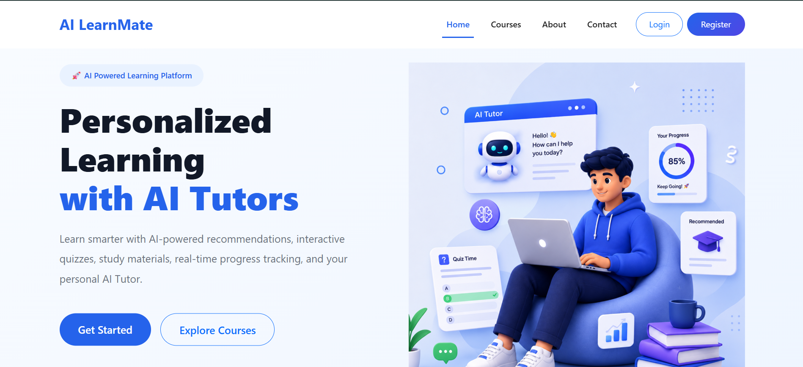
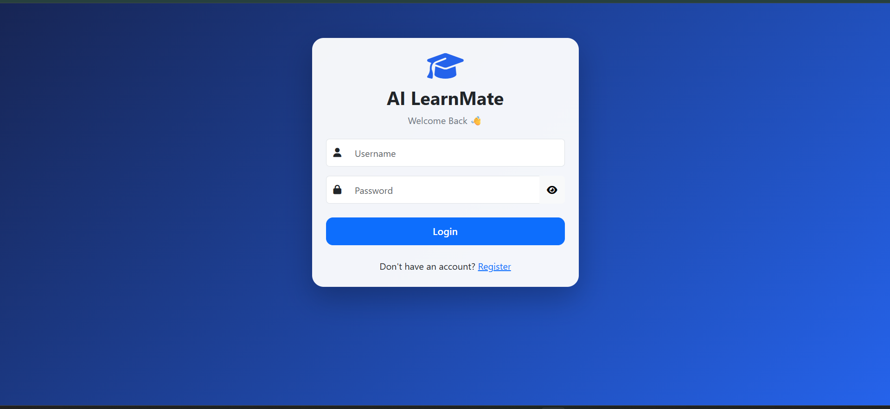
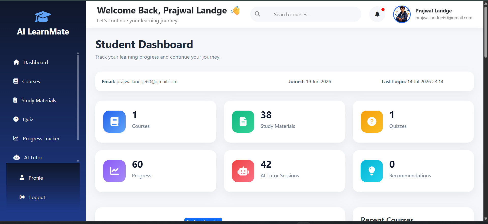
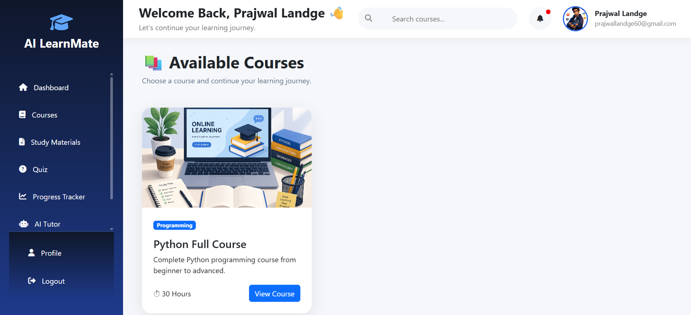
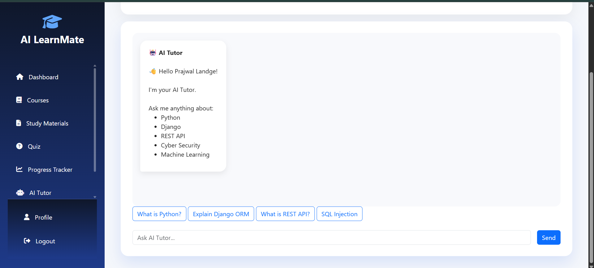
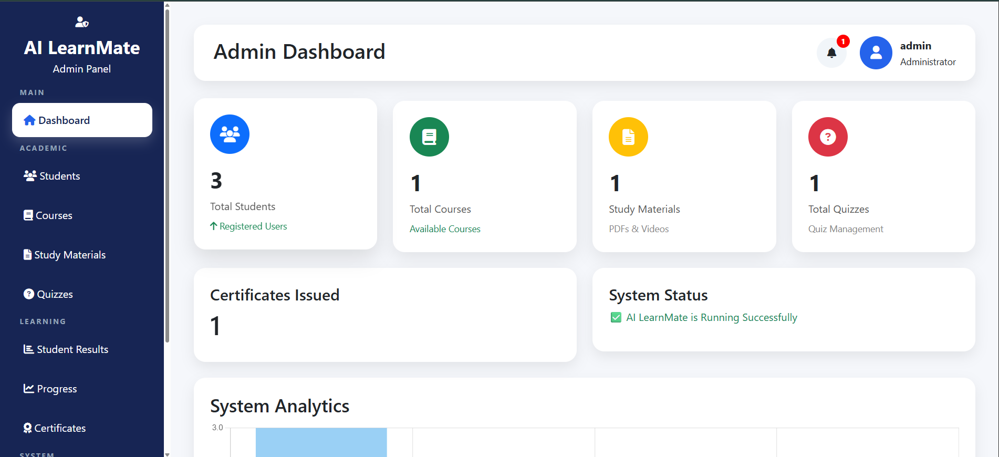

# 🎓 AI LearnMate

> **An AI-Powered Learning Management System (LMS)** built with **Django**, **MySQL**, and **Google Gemini AI**.

AI LearnMate is a modern Learning Management System that provides students with personalized learning through AI tutoring, quizzes, progress tracking, study materials, recommendations, certificates, and a professional admin dashboard.

---

## 🌟 Key Highlights

- 🤖 AI Tutor powered by Google Gemini
- 📚 Course & Study Material Management
- 📝 Quiz & Automatic Evaluation
- 📈 Progress Tracking
- 🏆 Certificate Generation
- 🔔 Notification System
- 👨‍🎓 Student Dashboard
- 👨‍💼 Professional Admin Dashboard
- 🔐 Secure Authentication System

---

# 🛠️ Tech Stack

## Backend
- Python 3.12
- Django 5.x
- Django REST Framework

## Frontend
- HTML5
- CSS3
- Bootstrap 5
- JavaScript

## Database
- MySQL 8

## AI Integration
- Google Gemini API

## Libraries
- ReportLab
- Pillow
- qrcode

## Tools
- Git
- GitHub
- PyCharm
- Postman

---

# 📚 Project Modules

### Student Module
- User Authentication
- Student Dashboard
- Profile Management
- Course Enrollment
- Study Materials
- Quiz System
- Progress Tracker
- AI Tutor
- Recommendations
- Certificate Download

### Admin Module
- Dashboard Analytics
- Student Management
- Course Management
- Study Material Management
- Quiz Management
- Progress Monitoring
- Certificates
- Notifications
- AI Tutor Logs

## 📸 Screenshots

### 🏠 Home Page

### 🔐 Login

### 📊 Student Dashboard

### 📚 Courses

### 🤖 AI Tutor

### 🛠️ Admin Dashboard

## 🚀 Future Improvements

AI LearnMate is designed to be continuously enhanced. Planned future features include:

- 🤖 Advanced AI Tutor with conversation history
- 🎙️ Voice-based AI learning assistant
- 📱 Responsive mobile application (Android & iOS)
- 📹 Live online classes and video streaming
- 💬 Real-time chat between students and instructors
- 📅 Smart study planner with reminders
- 🏆 Gamification (Badges, XP, Leaderboards)
- 📈 Advanced analytics and learning insights
- 🌙 Dark Mode support
- 🌍 Multi-language support
- ☁️ Cloud deployment (AWS / Azure / Render)
- 🔐 OAuth Login (Google & GitHub)
- 📧 Email verification and password reset
- 💳 Premium subscription and payment integration
- 📊 AI-powered personalized learning recommendations

## 👨‍💻 Author

**Prajwal Landge**

 Full Stack Python Developer | AI & Cyber Security Enthusiast

- 💼 GitHub: https://github.com/Landge28
- 💼 LinkedIn: https://www.linkedin.com/in/prajwal-landge/   <!-- Replace if needed -->
- 📧 Email: prajwallandge60@gmail.com

If you found this project useful, consider giving it a ⭐ on GitHub.
